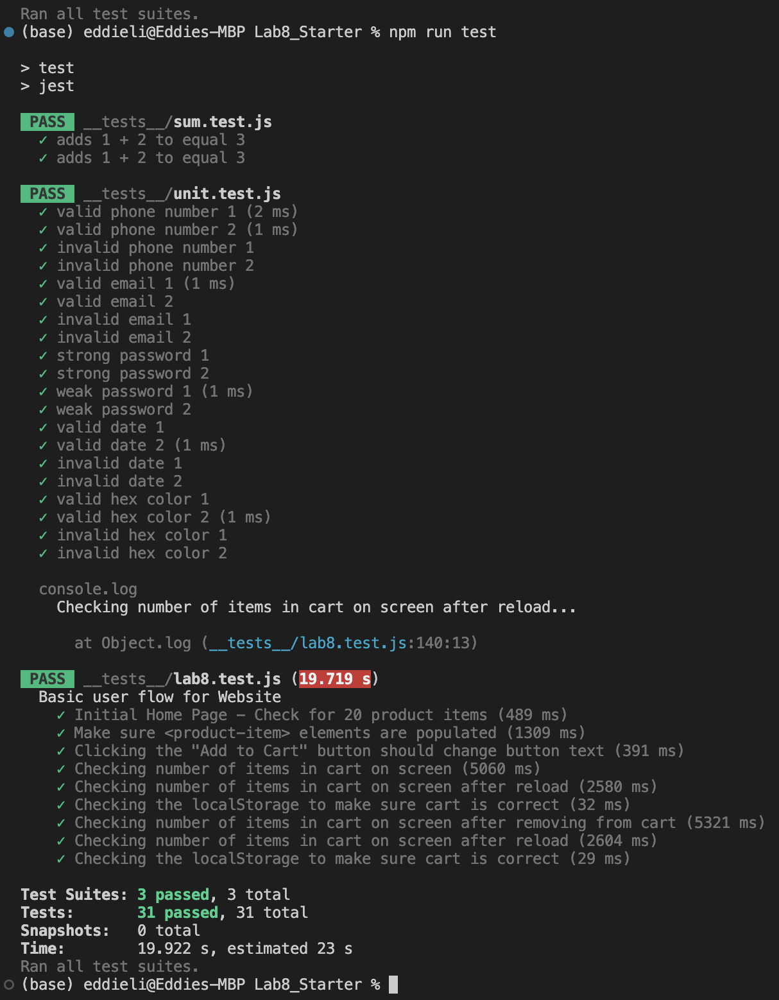

# Lab 8 - Starter

## 1. Where would you fit your automated tests in your Recipe project development pipeline?

One example of where you'd find automated tests in the Recipe project is within a Github action that runs whenever code is pushed. The other mentioned places are also great places to run tests, but just as a single example, running the tests in a Github action that runs whenever code is puhsed ensures that you will catch any issues when pushing code and also mark which versions of the code work and do not work.

## 2. Would you use an end to end test to check if a function is returning the correct output?

No, although it could theoretically be used to check this in some manner, that would be a task better suited for unit testing due to its isolated nature.

## 3. Would you use a unit test to test the “message” feature of a messaging application?

No, this is an end to end feature that likely involves many parts of the software and will be very difficult if not impossible to isolate as a single unit test. Therefore, this is not a good fit for a unit test and would instead be better as an end to end test.

## 4. Would you use a unit test to test the “max message length” feature of a messaging application?

Yes, this feature is likely an isolated feature that can be individually tested. This functionality can easily boil down to a single function that you can test with a unit test, and is thus a good fit for a unit test. 

## Test Results

